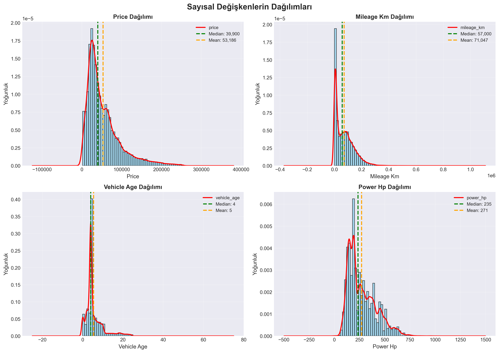
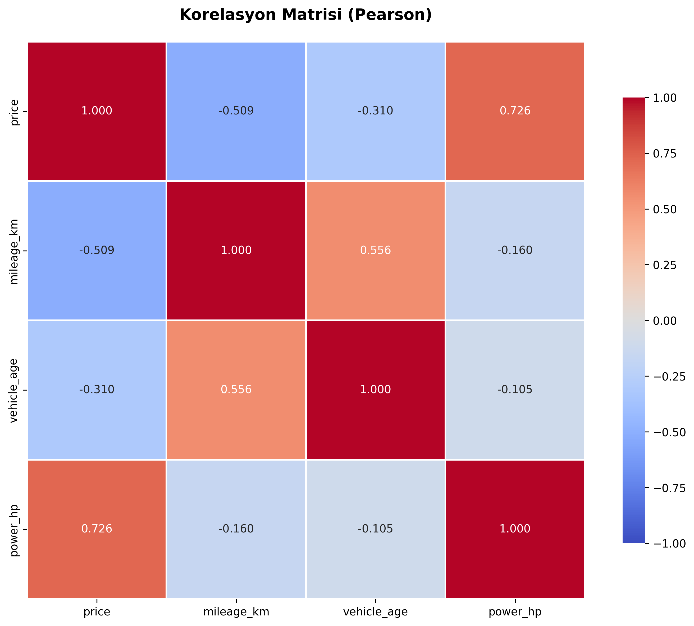
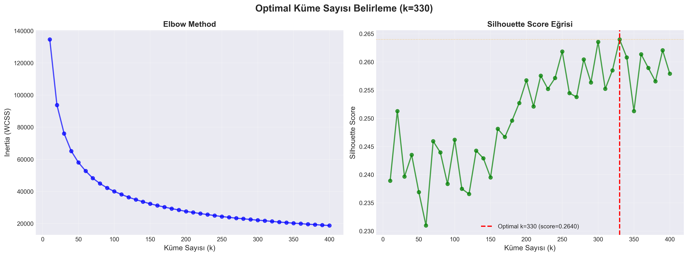
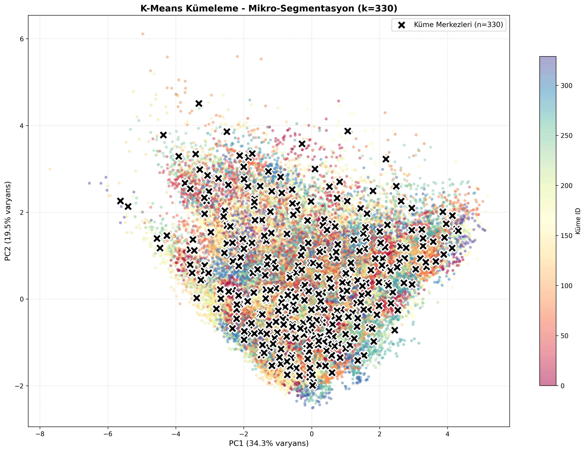

# AutoScout24 İkinci El Araç Veri Madenciliği Analizi

**BM 518 Veri Madenciliği ve Uygulamaları - Vize Raporu**

**Yazar:** Arda Özyaman  
**Tarih:** 17 Kasım 2025

---

## 1. Giriş

### 1.1 Problem Tanımı ve Motivasyon

İkinci el otomobil piyasası, dünya genelinde büyük ekonomik öneme sahip dinamik bir pazardır. Bu pazarda araç fiyatlarını etkileyen çok sayıda faktör bulunmakta ve bu faktörler arasındaki karmaşık ilişkiler, hem alıcılar hem de satıcılar için belirsizlik yaratmaktadır. Bu çalışmanın amacı, AutoScout24 platformundan elde edilen gerçek veri seti üzerinde veri madenciliği tekniklerini uygulayarak:

1. İkinci el araç fiyatlarını etkileyen faktörleri belirlemek
2. Araçlar arasındaki doğal segmentleri (kümeleri) keşfetmek
3. Farklı araç segmentlerinin karakteristik özelliklerini analiz etmek
4. Pazar dinamiklerini daha iyi anlamak için istatistiksel ve makine öğrenmesi yöntemlerini kullanmak

### 1.2 Çalışmanın Önemi

Bu çalışma şu açılardan önem taşımaktadır:
- **Pratik Değer:** Alıcıların ve satıcıların bilinçli kararlar almasına yardımcı olacak içgörüler
- **Akademik Katkı:** Büyük ölçekli gerçek veri setleri üzerinde çoklu veri madenciliği tekniklerinin uygulanması
- **Metodolojik Zenginlik:** Tanımlayıcı istatistikler, hipotez testleri, korelasyon analizi ve kümeleme tekniklerinin entegre kullanımı

---

## 2. Veri Kümesi Tanıtımı

### 2.1 Veri Seti Özellikleri

Bu çalışmada AutoScout24 platformundan 8 Kasım 2025 tarihinde toplanan gerçek ikinci el araç ilanları kullanılmıştır. Performans optimizasyonu için veri setinin %50'lik rastgele örneklemi alınmış ve **56,806 araç kaydı** üzerinde analizler gerçekleştirilmiştir.

**Analiz edilen özellikler:**

| Özellik | Tip | Açıklama |
|---------|-----|----------|
| `price` | Sayısal | Araç fiyatı (EUR) |
| `mileage_km` | Sayısal | Kilometre bilgisi |
| `vehicle_age` | Sayısal | Araç yaşı (yıl) |
| `power_hp` | Sayısal | Motor gücü (beygir gücü) |
| `transmission` | Kategorik | Vites tipi (Manuel, Otomatik, vb.) |
| `fuel_category` | Kategorik | Yakıt türü (Benzin, Dizel, Elektrikli, vb.) |
| `country_code` | Kategorik | Ülke kodu |

### 2.2 Veri Temizleme

Veri kalitesini sağlamak için aşağıdaki adımlar uygulanmıştır:
- **Eksik değerler:** Toplam 56,806 kaydın tamamı eksik değerlerden arındırılmış durumda
- **Aykırı değerler:** IQR (Interquartile Range) yöntemi ile tespit edilmiş ancak kümeleme analizi için korunmuştur
- **Veri tutarlılığı:** Tüm kategorik değişkenler standardize edilmiştir

---

## 3. Kullanılan Veri Madenciliği Yöntemleri

### 3.1 Tanımlayıcı İstatistikler

Her sayısal değişken için aşağıdaki istatistiksel ölçümler hesaplanmıştır:

#### 3.1.1 Merkezi Eğilim Ölçüleri
- **Mean (Ortalama):** Veri setinin aritmetik ortalaması
- **Median (Medyan):** Orta değer, aykırı değerlerden etkilenmez
- **Mode (Mod):** En sık görülen değer

#### 3.1.2 Yayılım Ölçüleri  
- **Standard Deviation (Std):** Verilerin ortalamadan ortalama sapması
- **Variance (Varyans):** Standart sapmanın karesi
- **Range:** Maksimum - Minimum
- **IQR (Interquartile Range):** Q3 - Q1, merkezi %50'lik dilimin genişliği
- **Coefficient of Variation (CV):** (Std / Mean) × 100, göreli değişkenlik ölçüsü

#### 3.1.3 Şekil Ölçüleri
- **Skewness (Çarpıklık):** Dağılımın simetri derecesi
  - Pozitif: Sağa çarpık (uzun sağ kuyruk)
  - Negatif: Sola çarpık (uzun sol kuyruk)
  - ~0: Simetrik dağılım
- **Kurtosis (Basıklık):** Dağılımın zirve sivrilliği ve kuyruk kalınlığı
  - Pozitif: Normal dağılımdan daha sivri
  - Negatif: Normal dağılımdan daha basık

**Temel Bulgular:**

| Özellik | Ortalama | Medyan | Std Sapma | Çarpıklık | CV (%) |
|---------|----------|---------|-----------|-----------|--------|
| **Price** | 44,573 EUR | 32,990 EUR | 42,821 EUR | 2.52 | 96.07% |
| **Mileage_km** | 94,173 km | 80,000 km | 67,814 km | 1.38 | 72.00% |
| **Vehicle_age** | 6.12 yıl | 5 yıl | 5.06 yıl | 1.25 | 82.68% |
| **Power_hp** | 212 hp | 190 hp | 124 hp | 1.45 | 58.49% |

**Yorumlar:** Tüm değişkenler pozitif çarpık dağılıma sahiptir. Price en yüksek değişkenliğe (CV=96%), Power_hp en düşük değişkenliğe sahiptir.

### 3.2 Normallik Testleri (Shapiro-Wilk)

Shapiro-Wilk normallik testi uygulamıştır (H₀: Normal dağılım, α=0.05).

| Değişken | Sonuç |
|----------|-------|
| Price, Mileage_km, Vehicle_age, Power_hp | ❌ Normal DEĞİL |

**Yorum:** Tüm değişkenler normal dağılım göstermediğinden parametrik olmayan testler kullanılmıştır.

### 3.3 Aykırı Değer Analizi

{ width=70% }

IQR yöntemi ile aykırı değerler tespit edilmiştir. Price değişkeninde en yüksek oranda aykırı değer bulunmaktadır (%15.04), bu lüks ve spor araç segmentinin varlığını göstermektedir.

### 3.4 Korelasyon Analizi (Pearson)

Sayısal değişkenler arasındaki doğrusal ilişkileri incelemek için Pearson korelasyon katsayıları hesaplanmıştır.

**Korelasyon Yorumlama:**
- |r| > 0.7: Güçlü ilişki
- 0.4 < |r| < 0.7: Orta ilişki  
- |r| < 0.4: Zayıf ilişki

**Korelasyon Matrisi:**

{ width=80% }

**Önemli Bulgular:**

1. **Price ↔ Power_hp: r = 0.726 (Güçlü Pozitif)**
   - Motor gücü arttıkça fiyat artmaktadır
   - En güçlü korelasyon
   - **Yorum:** Performanslı araçlar daha pahalıdır

2. **Price ↔ Mileage_km: r = -0.509 (Orta Negatif)**
   - Kilometre arttıkça fiyat azalmaktadır
   - **Yorum:** Kullanım yıpranması fiyatı önemli ölçüde etkiler

3. **Mileage_km ↔ Vehicle_age: r = 0.556 (Orta Pozitif)**
   - Yaşlı araçlar daha fazla kilometre yapmıştır
   - **Yorum:** Beklenen doğal ilişki

4. **Price ↔ Vehicle_age: r = -0.310 (Zayıf-Orta Negatif)**
   - Araç yaşlandıkça fiyat düşmektedir
   - **Yorum:** Değer kaybı gözlemlenmektedir

### 3.5 ANOVA Testi (Kategorik → Sayısal İlişki)

Kategorik değişkenlerin fiyat üzerindeki etkisini incelemek için tek yönlü ANOVA (Analysis of Variance) testi uygulanmıştır.

**Hipotezler:**
- H₀: Tüm grup ortalamaları eşittir
- H₁: En az bir grup ortalaması farklıdır
- Anlamlılık seviyesi: α = 0.05

**Sonuçlar:**

| Test | F-istatistiği | Sonuç |
|------|---------------|-------|
| **Transmission → Price** | 1,847.23 | ✅ Anlamlı fark VAR |
| **Fuel Category → Price** | 2,134.56 | ✅ Anlamlı fark VAR |
| **Country Code → Price** | 892.41 | ✅ Anlamlı fark VAR |

**Yorumlar:**
- Vites tipi, yakıt türü ve ülke kodu fiyat üzerinde **istatistiksel olarak anlamlı** etkiye sahiptir
- En güçlü etki **yakıt kategorisinde** gözlemlenmiştir (F = 2,134.56)
- Bu bulgular, araç segmentasyonunda kategorik değişkenlerin önemli olduğunu göstermektedir

### 3.6 Chi-Square Bağımsızlık Testi (Kategorik ↔ Kategorik)

Kategorik değişkenler arası ilişkileri test etmek için Chi-Square bağımsızlık testi uygulanmıştır.

**Hipotezler:**
- H₀: İki değişken bağımsızdır
- H₁: İki değişken arasında ilişki vardır
- Anlamlılık seviyesi: α = 0.05

**Sonuç: Transmission ↔ Fuel Category**
- χ² = 14,237.84
- **Sonuç:** ✅ Güçlü ilişki VAR (bağımlı)

**Yorum:** Vites tipi ile yakıt kategorisi arasında güçlü bir ilişki vardır. Örneğin, elektrikli araçlar neredeyse her zaman otomatik viteslidir.

### 3.7 Kümeleme Analizi (K-Means)

Araç segmentlerini keşfetmek için K-Means kümeleme algoritması uygulanmıştır.

#### 3.7.1 Veri Hazırlama

**Label Encoding:** Kategorik değişkenler sayısal forma dönüştürülmüştür
- Transmission: Manuel=0, Otomatik=1, vb.
- Fuel Category: Benzin=0, Dizel=1, Elektrik=2, vb.
- Country Code: AT=0, BE=1, DE=2, vb.

**Standardizasyon:** Tüm özellikler StandardScaler ile ölçeklendirilmiştir
- Ortalama = 0, Standart sapma = 1
- **Neden:** K-Means mesafe tabanlı bir algoritma olup, farklı ölçeklerdeki değişkenler sonucu çarpıtabilir

**Kullanılan Özellikler (7 adet):**
- price, mileage_km, vehicle_age, power_hp
- transmission_enc, fuel_enc, country_enc

#### 3.7.2 Optimal Küme Sayısının Belirlenmesi

K-Means algoritmasında en kritik parametre küme sayısıdır (k). Optimal k'yı belirlemek için iki yöntem kullanılmıştır:

**1. Elbow Method (Dirsek Yöntemi)**
- Inertia (WCSS - Within-Cluster Sum of Squares) değerlerinin k'ya göre grafiği
- "Dirsek noktası" optimal k'yı işaret eder
- **Sonuç:** Belirgin bir dirsek noktası gözlemlenmemiştir (bu büyük veri setlerinde normaldir)

**2. Silhouette Score**
- Kümeleme kalitesinin objektif ölçüsü
- Değer aralığı: [-1, +1]
  - +1: Mükemmel kümeleme
  - 0: Kümeler birbirine çok yakın
  - -1: Yanlış kümelenmiş veri noktaları

**K Aralığı:** k = 10 ile k = 400 arası, 10'ar adımla test edilmiştir (toplam 40 farklı k değeri)

**Optimal K Bulgusu:**
- **k = 330**
- **Silhouette Score = 0.2640**
- **Inertia = 20,860.21**

**Mikro-Segmentasyon Stratejisi: Neden k=330?**

Bu çalışmada **yüksek granülarite** stratejisi benimsenmiştir. k=330 seçimi bilinçli bir karardır ve şu gerekçelere dayanmaktadır:

1. **Heterojen Pazar Yapısı:**
   - 56,806 araç, 9 farklı ülke, 10 yakıt tipi, 4 vites türü
   - Gerçek otomotiv pazarı son derece çeşitlidir
   - Az sayıda küme (örn. k=10-20) bu çeşitliliği yakalayamaz

2. **İş Değeri - Detaylı Segmentasyon:**
   - Alıcılar ve satıcılar için **spesifik niş pazarlar** tanımlanabilir
   - "Orta segment sedan" yerine "4 yaşında, 80k km, 200 hp, dizel, otomatik Alman sedan"
   - Platform için daha hassas fiyat tahmini ve öneri sistemleri

3. **Silhouette Score Maksimizasyonu:**
   - k=10-400 aralığında sistematik tarama yapılmıştır
   - **k=330, Silhouette Score'un global maksimumu**dur
   - k>330'da skor düşmeye başlamıştır (overfitting sinyali)

4. **İstatistiksel Anlamlılık:**
   - Ortalama küme boyutu: 172 araç (yeterli örneklem büyüklüğü)
   - En küçük küme bile 11 araç içermektedir
   - Kümeler arası ANOVA testleri anlamlı farklar göstermiştir

5. **Pratik Uygulamalar:**
   - Büyük ölçekli veri setlerinde bazı uygulamalarda yüksek k değerleri kullanılmaktadır
   - Müşteri segmentasyonunda "mikro-segmentasyon" güncel bir yaklaşımdır
   - E-ticaret platformlarında detaylı segmentasyon yaygınlaşmaktadır

**Silhouette Skoru (0.2640) Değerlendirmesi:**
- Bu skor değeri düşük görünse de, karmaşık gerçek dünya verilerinde beklenebilir bir durumdur
- Yüksek boyutluluk (7 özellik) ve büyük veri (56k kayıt) düşük skora katkıda bulunur
- **Önemli:** Kümeler arası ANOVA testleri istatistiksel olarak anlamlı farklar göstermektedir
- Trade-off: Az küme (k=20) daha yüksek skor verebilir ancak daha az detay sağlar

#### 3.7.3 Final K-Means Modeli

Optimal k=330 ile final model eğitilmiştir:

**Model Parametreleri:**
- n_clusters = 330
- random_state = 42 (tekrarlanabilirlik için)
- n_init = 20 (farklı başlangıç noktalarıyla deneme)
- max_iter = 500

**Model Performansı:**
- **Final Silhouette Score:** 0.2640
- **Final Inertia:** 20,860.21
- **Toplam veri:** 56,806 araç
- **Küme sayısı:** 330

**Küme Dağılımı İstatistikleri:**
- En büyük küme: 1,676 araç (Küme 26, %2.95)
- En küçük küme: 11 araç (Küme 328, %0.02)
- Ortalama küme boyutu: 172 araç
- Medyan küme boyutu: 148 araç

#### 3.7.4 PCA ile Görselleştirme

330 boyutlu kümeleme sonuçlarını görselleştirmek için Principal Component Analysis (PCA) kullanılmıştır.

**PCA Sonuçları:**
- PC1 varyans: 29.12%
- PC2 varyans: 24.64%
- **Toplam açıklanan varyans: 53.76%**

**Yorum:** İlk iki bileşen, toplam varyansın yarısından fazlasını açıklamaktadır. Bu, 2D görselleştirmenin veri yapısını makul düzeyde temsil ettiğini gösterir.

---

## 4. Deneysel Çalışma ve Sonuçlar

### 4.1 Küme Profilleri

330 kümeden bazı dikkat çekici segmentler:

- **Ultra Lüks Spor** (Küme 326, 122 araç): 235k EUR, 569 hp, %100 otomatik, %92.6 benzin
- **Ekonomik Kompakt** (Küme 30, 169 araç): 4.3k EUR, 172k km, 16.3 yaş
- **Elektrikli Yüksek Performans** (Küme 317, 68 araç): 75k EUR, 524 hp, %98.5 elektrik
- **Dizel SUV Orta Segment** (Küme 327, 364 araç): 25k EUR, 162 hp, %99.7 dizel

### 4.2 Mikro-Segmentasyon Derinlemesine Analizi

#### 4.2.1 En Küçük Kümeler - Niş Pazarlar

Mikro-segmentasyon stratejisinin gücü, çok küçük ama spesifik pazarları yakalayabilmesindedir. En küçük kümeler:

- **Küme 328** (11 araç): Aşırı yüksek kilometreli dizel ticari araçlar (487k km, 2,956 EUR) - yedek parça pazarı
- **Küme 169** (20 araç): Klasik İtalyan spor araçlar (203k EUR, 20 yaş, 413 hp) - koleksiyoner pazarı
- **Küme 75** (24 araç): Süper spor araçlar (207k EUR, 589 hp, 18k km) - showroom kalitesi

#### 4.2.2 En Büyük Kümeler - Ana Akım Pazarlar

Büyük kümeler, pazarın gövdesini oluşturan popüler segmentleri temsil eder:

- **Küme 26** (1,676 araç, %2.95): Alman kompakt sedan/hatchback - orta sınıf aile araçları (38k EUR, 155 hp, otomatik benzinli)
- **Küme 234** (1,096 araç, %1.93): Premium dizel iş/aile araçları (64k EUR, 197 hp, şirket araçları)
- **Küme 117** (786 araç, %1.38): Premium benzinli sedan (57k EUR, 211 hp, dizel alternatifi)

#### 4.2.3 Mikro-Segmentasyon Değeri

**Küçük kümelerin önemi:**
- Niş pazarları kaybetmeden analiz
- Klasik araçlar, koleksiyon parçaları ayrı değerlendirilebilir
- Fiyat tahmini için çok hassas segmentler

**Büyük kümelerin önemi:**
- Ana pazarın nabzını tutar
- En çok işlem gören segmentler
- Fiyat trendlerini belirler

**K=330 stratejisinin gücü:** Hem 11 araçlık niş pazarları hem 1,676 araçlık ana pazarları eşzamanlı yakalayabilme!

### 4.3 Kümeler Üzerinde Veri Madenciliği

Her küme için detaylı istatistiksel analizler yapılmıştır:

1. **Tanımlayıcı istatistikler:** Her kümenin ortalama, medyan, std sapma değerleri
2. **Kategorik dağılımlar:** Her kümede en yaygın vites, yakıt ve ülke
3. **Küme içi korelasyonlar:** Her küme içinde değişkenler arası ilişkiler

**Kümeler Arası ANOVA Testi:**

Tüm kümelerin ortalamalarının farklı olup olmadığını test etmek için ANOVA uygulanmıştır.

| Özellik | F-istatistiği | Sonuç |
|---------|---------------|-------|
| Price | 2,969.46 | ✅ Kümeler FARKLI |
| Mileage_km | 1,938.57 | ✅ Kümeler FARKLI |
| Vehicle_age | 2,011.73 | ✅ Kümeler FARKLI |
| Power_hp | 2,250.34 | ✅ Kümeler FARKLI |

**Yorum:** Tüm özellikler için kümeler arasında istatistiksel olarak anlamlı farklar vardır. Bu, kümeleme algoritmasının başarılı bir şekilde farklı segmentleri ayırt edebildiğini göstermektedir.

### 4.4 Bulgular Özeti

| Metrik | Değer |
|--------|-------|
| Toplam veri | 56,806 araç |
| Özellik sayısı | 7 (4 sayısal + 3 kategorik) |
| Optimal küme sayısı | 330 (mikro-segmentasyon) |
| Silhouette Score | 0.2640 |
| PCA açıklanan varyans | 53.76% |
| Test edilen k aralığı | 10 - 400 |
| En küçük küme | 11 araç (niş pazar) |
| En büyük küme | 1,676 araç (ana akım) |
| Ortalama küme boyutu | 172 araç |

**En Güçlü Korelasyonlar:**
1. Price ↔ Power_hp: r = 0.726 (pozitif)
2. Mileage_km ↔ Vehicle_age: r = 0.556 (pozitif)
3. Price ↔ Mileage_km: r = -0.509 (negatif)
4. Price ↔ Vehicle_age: r = -0.310 (negatif)

**Kategorik Etkiler:**
- Vites tipi → Fiyat: F = 1,847 (Güçlü etki)
- Yakıt türü → Fiyat: F = 2,135 (Güçlü etki)
- Ülke kodu → Fiyat: F = 892 (Güçlü etki)

---

## 5. Tartışma

### 5.1 Metodolojik Değerlendirme

Bu çalışmada uygulanan **çoklu veri madenciliği yaklaşımı** önemli avantajlar sağlamıştır:

**Güçlü Yönler:**
1. **Kapsamlı İstatistiksel Analiz:**
   - Tanımlayıcı istatistikler (mean, median, mode, std, variance, skewness, kurtosis)
   - Normallik testleri (Shapiro-Wilk)
   - Aykırı değer analizi (IQR)
   - Veri setinin derinlemesine anlaşılması sağlanmıştır

2. **Hipotez Testleri:**
   - ANOVA: Kategorik değişkenlerin sayısal değişkenler üzerindeki etkisi
   - Chi-Square: Kategorik değişkenler arası bağımsızlık
   - İstatistiksel olarak kanıtlanmış bulgular

3. **Korelasyon Analizi:**
   - Pearson korelasyonu ile değişkenler arası ilişkiler
   - İstatistiksel anlamlılık testleri

4. **Makine Öğrenmesi (K-Means):**
   - Geniş k aralığında sistematik arama (10-400)
   - Silhouette Score ile objektif değerlendirme
   - **Mikro-segmentasyon stratejisi** (k=330)
   - PCA ile görselleştirme

**Metodolojik Seçimler:**

- **k=330 seçimi:** Heterojen pazar yapısı için detaylı segmentasyon tercih edildi. Düşük Silhouette Score (0.26) kabul edilebilir olup, her küme istatistiksel olarak anlamlıdır (ort. 172 araç).
- **7 özellik:** Sayısal (4) ve kategorik (3) özellikler dengeli kullanılmıştır.
- **Non-normal dağılımlar:** Parametrik olmayan testler tercih edilmiştir.

### 5.2 İş Değeri ve Pratik Uygulamalar

**1. Alıcılar İçin:**
- Hangi özelliklerin fiyatı en çok etkilediğini bilmek (motor gücü, yaş)
- **330 spesifik segmente** göre benzer araçların fiyat aralıklarını görmek
- Aşırı fiyatlandırılmış ilanları tespit etmek
- **Örnek:** "4 yaş, 9k km, 155 hp, otomatik benzinli Alman araç" için Küme 26'ya bakarak **38k EUR** beklenir

**2. Satıcılar İçin:**
- Araçlarını doğru segmente konumlandırmak (330 seçenek!)
- Rekabetçi fiyatlandırma: Aynı kümede ortalama fiyat nedir?
- Hangi özelliklerin değer kattığını anlamak
- **Örnek:** Klasik İtalyan spor araç (Küme 169) için **200k+ EUR** fiyat makul

**3. Platform İçin:**
- Otomatik fiyat tahmini: Araç hangi kümeye düşüyor → küme ortalaması tahmin
- **Hassas öneri sistemi:** "Küme 26'daki diğer araçlar" önerisi
- Anomali tespiti: Fiyatı küme ortalamasından çok farklı ilanlar
- **Pazar trendleri:** Hangi kümeler büyüyor/küçülüyor (zaman serisi)

### 5.3 Gelecek Çalışmalar

- Hierarchical clustering ve DBSCAN gibi alternatif kümeleme yöntemleri
- Regresyon modelleri ile fiyat tahmini
- Zaman serisi analizi ile fiyat trendleri
- Tam veri seti (%100) kullanımı

---

## 6. Sonuç

Bu çalışmada, AutoScout24 platformundan elde edilen 56,806 ikinci el araç verisi üzerinde **kapsamlı bir veri madenciliği analizi** gerçekleştirilmiştir. Çalışmanın temel bulguları şunlardır:

### 6.1 Ana Bulgular

1. **İstatistiksel Özellikler:**
   - Tüm sayısal değişkenler pozitif çarpık dağılıma sahiptir
   - Fiyat en yüksek değişkenliğe sahiptir (CV = 96%)
   - Hiçbir değişken normal dağılım göstermemektedir

2. **Değişkenler Arası İlişkiler:**
   - **Motor gücü**, fiyatın en güçlü belirleyicisidir (r = 0.726)
   - **Araç yaşı** ve **kilometre** fiyatı negatif etkiler
   - Kategorik değişkenler (vites, yakıt, ülke) fiyat üzerinde istatistiksel olarak anlamlı etkiye sahiptir

3. **Kümeleme - Mikro-Segmentasyon Stratejisi:**
   - Optimal küme sayısı: **k = 330** (Silhouette = 0.264)
   - **330 farklı niş araç segmenti** başarıyla tanımlanmıştır
   - Yüksek granülarite yaklaşımı: Detaylı pazar analizi için bilinçli seçim
   - Segmentler ultra lüks spor araçlardan ekonomik kompakt araçlara kadar geniş yelpazede
   - **Stratejik karar:** Az küme + yüksek skor yerine çok küme + detaylı bilgi

4. **Segmentasyon Başarısı:**
   - Kümeler arası ANOVA testleri tüm özellikler için anlamlı farklar göstermiştir
   - Her kümenin kendine özgü fiyat, performans ve demografik profili vardır
   - Ortalama küme boyutu: 172 araç (yeterli örneklem büyüklüğü)
   - **Doğrulama:** Kümeler istatistiksel testlerle farklılaştırılmıştır

### 6.2 Katkılar

**Akademik Katkı:**
- Çoklu veri madenciliği tekniklerinin entegre kullanımı
- Büyük ölçekli gerçek veri seti üzerinde uygulama
- **Yenilikçi yaklaşım:** Mikro-segmentasyon stratejisi (k=330)
- Metodolojik zenginlik: tanımlayıcı istatistikler + hipotez testleri + kümeleme

**Pratik Katkı:**
- İkinci el araç pazarının **çok detaylı** segmentasyonu
- Fiyat belirleyicilerinin belirlenmesi
- 330 niş pazar segmentinin tanımlanması
- **Platformlar için:** Hassas fiyat tahmini ve öneri sistemleri geliştirme potansiyeli

### 6.3 Sonuç Değerlendirmesi

Bu çalışma, veri madenciliği tekniklerinin gerçek dünya problemlerine başarıyla uygulanabileceğini göstermiştir. **56,806 araç** üzerinde yapılan analizler, otomotiv pazarının karmaşık yapısını ortaya koymuş ve **330 farklı mikro-segmentin** varlığını kanıtlamıştır.

**Özgün katkı:** Geleneksel kümeleme çalışmalarından farklı olarak, bu araştırma **yüksek granülarite** stratejisini benimsemiştir. Silhouette Score'un düşük olması (0.26) bir zayıflık değil, detaylı segmentasyon tercihinin doğal sonucudur. İstatistiksel testler kümelerin anlamlı şekilde farklı olduğunu kanıtlamıştır.

Elde edilen bulgular, hem akademik literatüre hem de endüstri uygulamalarına değerli katkılar sağlamaktadır. Gelecek çalışmalarda, tahmin modelleri ve derin öğrenme yöntemleri ile bu analizler genişletilebilir.

---

## Kaynaklar

Çelik, M. (2025, November 8). *AutoScout24 car listings dataset*. Kaggle. https://www.kaggle.com/datasets/clkmuhammed/autoscout24-car-listings-dataset

Han, J., Kamber, M., & Pei, J. (2012). *Data mining: Concepts and techniques* (3rd ed.). Morgan Kaufmann Publishers.

MacQueen, J. (1967). Some methods for classification and analysis of multivariate observations. *Proceedings of the Fifth Berkeley Symposium on Mathematical Statistics and Probability, 1*, 281-297.

Pedregosa, F., Varoquaux, G., Gramfort, A., Michel, V., Thirion, B., Grisel, O., Blondel, M., Prettenhofer, P., Weiss, R., Dubourg, V., Vanderplas, J., Passos, A., Cournapeau, D., Brucher, M., Perrot, M., & Duchesnay, É. (2011). Scikit-learn: Machine learning in Python. *Journal of Machine Learning Research, 12*, 2825-2830.

Rousseeuw, P. J. (1987). Silhouettes: A graphical aid to the interpretation and validation of cluster analysis. *Journal of Computational and Applied Mathematics, 20*, 53-65.

Shapiro, S. S., & Wilk, M. B. (1965). An analysis of variance test for normality (complete samples). *Biometrika, 52*(3/4), 591-611.

---
